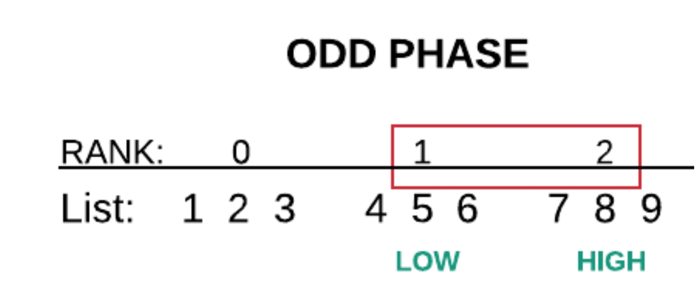

# Parallel Sorting Algorithms with MPI

This project implements and evaluates three parallel sorting algorithms using **C++** and **MPI (Message Passing Interface)**. The algorithms include:

- **Parallel Bitonic Sort**
- **Parallel Odd-Even Sort**
- **Parallel Quick Sort**

The implementation explores task distribution, message passing strategies, and process dependencies, and compares the performance of parallel and serial versions.

## Table of Contents

- [Introduction](#introduction)
- [Algorithms](#algorithms)
  - [Parallel Odd-Even Sort](#parallel-odd-even-sort)
  - [Parallel Quick Sort](#parallel-quick-sort)
  - [Parallel Bitonic Sort](#parallel-bitonic-sort)
- [Performance Analysis](#performance-analysis)

## Introduction

Parallel sorting algorithms are crucial for processing large datasets efficiently. This project implements three parallel sorting algorithms using MPI to:

1. Distribute the sorting workload among multiple processes.
2. Minimize communication overhead while ensuring correct data merging.
3. Analyze performance improvements compared to serial implementations.

## Algorithms

### Parallel Odd-Even Sort

- **Description:** An extension of Bubble Sort, executed in two phases:

#### Even Phase
- **Operation:**
  - Compare and swap elements at even indices.
  - Odd-ranked processes keep larger elements; even-ranked processes keep smaller elements.

  

#### Odd Phase
- **Operation:**
  - Compare and swap elements at odd indices.
  - Odd-ranked processes keep smaller elements; even-ranked processes keep larger elements.

  

- **Work Distribution:**
  - Each process sorts its portion of data using a fast serial algorithm (e.g., Quick Sort).
  - Neighboring processes exchange and merge data iteratively.

- **Messaging:** Blocking communication using `MPI_Sendrecv` ensures synchronization before merging.

- **Process Dependencies:**

#### Even Phase Dependencies
- **Explanation:**
  - Even-ranked processes depend on their next higher-ranked neighbors.
  - Odd-ranked processes depend on their previous lower-ranked neighbors.

  

#### Odd Phase Dependencies
- **Explanation:**
  - Odd-ranked processes depend on their next higher-ranked neighbors.
  - Even-ranked processes depend on their previous lower-ranked neighbors.

  

- **Execution Times:**

  | Execution Type | Time (s) |
  |----------------|----------|
  | Serial         | 13.027   |
  | Parallel       | 5.33     |

---

### Parallel Quick Sort

- **Description:** A divide-and-conquer approach to sorting:
  1. Choose a pivot.
  2. Partition the array into smaller and larger elements.
  3. Sort partitions recursively.

- **Work Distribution:**
  - Each process handles a subsection of the array.
  - Sorted subsections are merged in `log(n)` steps.

- **Messaging:** Blocking communication using `MPI_Send` and `MPI_Recv` ensures data is available for merging.

- **Process Dependencies:**
  - Processes depend on neighbors during each merge step.
  - Tree-based merge minimizes communication overhead.

  

  At each merge step, processes with ranks divisible by `2 * step` must wait for their neighbors (with ranks equal to their rank + `step`) to send sorted subsequences.

- **Execution Times:**

  | Execution Type | Time (s) |
  |----------------|----------|
  | Serial         | 4.88     |
  | Parallel       | 0.82     |

---

### Parallel Bitonic Sort

- **Description:**
  The algorithm produces a sorted sequence through a series of **bitonic merges**, which convert two bitonic sequences into a sorted sequence. A sequence is bitonic if it first monotonically increases and then decreases, or vice versa.

  - **Algorithm Process Flow:**
    
    

    Initially, each process handles a local sorted sequence. Pairs of processes perform compare-and-exchange operations, iteratively converting subsequences into bitonic sequences and merging them into sorted sequences. This process continues until the entire sequence is sorted.

- **Work Distribution:**
  - Data is divided into subarrays, sorted locally.
  - Pairs of processes perform compare-and-exchange operations based on polarities dictated by the sorting network.

  - **Parallelization and Work Distribution:**
    

    At each stage, processes pair up to compare and exchange data. Smaller elements are retained by one process, and larger elements by the other. This ensures global sorting across stages.

- **Messaging:** Blocking communication using `MPI_Sendrecv` ensures synchronization before compare-and-exchange.

- **Process Dependencies:**
  - Dependencies vary by stage and step in the sorting network.

- **Execution Times:**

  | Execution Type | Time (s) |
  |----------------|----------|
  | Serial         | 13.14    |
  | Parallel       | 5.43     |

## Performance Analysis

Each algorithm's performance was evaluated based on:

1. **Speed-Up (S):** Ratio of serial to parallel execution time.
2. **Efficiency (E):** Speed-Up divided by the number of processes.
3. **Total Parallel Overhead (To):** Additional time spent on parallelization.
4. **Scalability:** How performance improves with more processes.

### Summary of Results

| Algorithm             | Speed-Up | Efficiency | Overhead  |
|-----------------------|----------|------------|-----------|
| Parallel Odd-Even Sort | 2.45     | 0.61       | 8.29s     |
| Parallel Quick Sort    | 5.95     | 0.74       | 1.6s      |
| Parallel Bitonic Sort  | 2.42     | 0.60       | 8.6s      |

*Note:* Scalability improves until communication overhead outweighs computation benefits.
